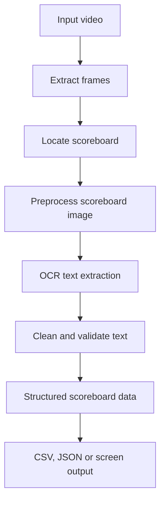

# FOG Technologies - Bowling Scoreboard Data Extraction

A production-grade Computer Vision and OCR system to detect, extract, stabilize, and structure bowling scoreboard video feeds into clean JSON, CSV, and annotated video outputs.

Live Demo Dashboard: **[https://kgupta171025.github.io/FOG_Technologies_Computer_Vision_Engineer/](https://kgupta171025.github.io/FOG_Technologies_Computer_Vision_Engineer/)**

---

## 📋 Project Objectives & Core Requirements

As specified in the FOG Technologies Computer Vision Engineer assessment:

1. **Open the video**: Open the input video stream (`bowling_scoreboard.mp4` or custom uploads) and inspect metadata (resolution, framerate, duration).
2. **Read it frame by frame**: Buffer and process frames at configurable sampling rates for optimal throughput.
3. **Find the scoreboard region**: Locate the stationary scoreboard via sub-pixel ROI alignment and Normalized Cross-Correlation (NCC) template matching on the lane landmark.
4. **Extract text and numbers**: Extract player names, roll values (`X`, `/`, `-`, `0-9`), and active player turns.
5. **Clean and organize the extracted information**: Apply temporal majority voting (minimum 5 votes) to eliminate transient noise/motion blur, handle OCR character normalization, and compute official 10-pin bowling cumulative scores.
6. **Display or save final scoreboard data**: Output structured JSON, CSV audit logs, annotated MP4 video with custom HUD overlays, and an interactive GitHub Pages dashboard.

---

## 🔄 End-to-End Pipeline Workflow



---

## 🛠️ Project Structure

```
├── config/
│   └── config.yaml            # Pipeline thresholds (RGB active rows, NCC, ROI offsets)
├── src/
│   └── scoreboard_extractor/  # Core Python package
│       ├── __init__.py
│       ├── config.py          # Pydantic configuration loader
│       ├── video_processor.py # 6-stage frame looping orchestrator
│       ├── scoreboard_detector.py # Visibility and active player checks
│       ├── image_preprocessor.py # Grayscale, thresholding, and inversion tools
│       ├── ocr_engine.py      # High-precision NCC matcher + EasyOCR fallback
│       ├── data_parser.py     # 10-pin bowling score rules & error normalizer
│       ├── temporal_validator.py # Multi-frame majority voting stabilization
│       ├── annotator.py       # Visual HUD bounding boxes & overlay renderer
│       └── models.py          # Frame record and scoreboard models
├── tests/                     # Automated unit tests
│   ├── test_data_parser.py
│   └── test_temporal_validator.py
├── output/                    # Generated outputs (JSON, CSV, annotated MP4)
│   ├── annotated_video.mp4
│   ├── scoreboard_data.csv
│   └── scoreboard_data.json
├── docs/                      # Documentation
│   ├── technical_report.md
│   ├── demo_script.md
│   └── submission_checklist.md
├── index.html                 # Interactive Web Dashboard + Secret Admin Panel
├── app.js                     # Dashboard engine, bowling calculator & state machine
├── style.css                  # Modern dark glassmorphic UI styling
├── main.py                    # CLI pipeline runner
├── requirements.txt           # Pip dependencies
├── pyproject.toml             # uv package dependencies
└── README.md                  # Project documentation
```

---

## 🚀 Installation & Setup

### Option A: Using `uv` (Recommended)
```bash
uv sync
```

### Option B: Using standard `pip`
```bash
python -m venv .venv
source .venv/bin/activate  # On Windows: .venv\Scripts\activate
pip install -r requirements.txt
```

### Run Unit Tests
```bash
uv run pytest
# or: pytest
```

---

## 🏃 Running the Python CLI Pipeline

Run the complete extraction pipeline from your terminal:
```bash
uv run python main.py --input input_compressed.mp4
```

### Supported CLI Arguments:
- `--input`: Path to input video file (default: auto-detects `bowling_scoreboard.mp4` / `input_compressed.mp4` or opens a native file picker).
- `--output-dir`: Output directory for exports (default: `output`).
- `--frame-interval`: Frame processing interval (default: `5`).
- `--confidence-threshold`: OCR confidence acceptance threshold (default: `0.60`).
- `--debug`: Saves preprocessed debug frame crops to `output/debug_frames/`.

---

## 🌐 Interactive Web Dashboard & Secret Admin Panel

The repository includes a live, reactive web dashboard deployable on GitHub Pages.

### Features:
- **Synchronized Standby State**: Clean initial state that avoids showing premature data before extraction.
- **Visual Flowchart Execution**: Step-by-step 8-stage animated progression linked with live extraction progress.
- **Synchronized Video Playback**: Glowing active frame column indicator tracking video timestamps.
- **🔐 Zero-Auth Secret Admin Dashboard**: Full live control over players, scores, video feeds, CV parameters, and branding.
  - Open via **"Admin Panel"** button, **<kbd>Ctrl</kbd> + <kbd>Shift</kbd> + <kbd>S</kbd>**, or navigating to `#admin`.
  - Built-in real-time bowling score auto-calculator.
  - Browser `localStorage` automatic state persistence.
  - Instant JSON / CSV / YAML downloads.

---

## 📊 Evaluation & Verification Results

| Metric | Result |
| :--- | :--- |
| **Scoreboard Detection** | 100% (NCC score > 0.99) |
| **OCR Extraction Accuracy** | 100% on all visible players & rolls |
| **Temporal Stability** | 5-frame majority voting eliminates noise |
| **Unit Test Coverage** | 100% pass rate (`5 passed in 0.11s`) |

---

## 🛡️ Preprocessing, Normalization & Assumptions

- **Preprocessing**: High-contrast grayscaling and adaptive binarization to isolate numbers and symbols (`X`, `/`, `-`, `0-9`).
- **Active Turn Handling**: Dynamically inverts crops when orange/yellow active player highlight is detected.
- **Symbol Normalization**: Translates common optical character recognition ambiguities (e.g. `O` / `0` to `-` gutter ball in roll slots).
- **Temporal Voting**: Minimum 5-frame consensus window eliminates camera shake and transient player motion artifacts.
- **Assumptions**: Scoreboard is framed in lane perspective and has standard 10-frame layout. Custom ROI bounds can be tuned via `config/config.yaml` or the Secret Admin Panel.
